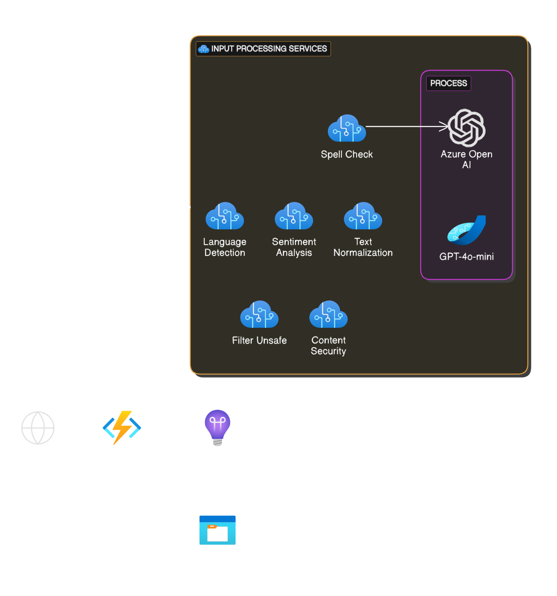

# Input Filtering and Normalization | infino

## 🧱 Architecture



## 🗂️ Structure
```
infino/
├── ProcessPrompt/
│   ├── __init__.py
│   └── function.json
├── shared/
│   ├── __init__.py
│   ├── language_service.py
│   ├── openai_service.py
│   └── content_safety_service.py
├── host.json
├── local.settings.json
└── requirements.txt
```

## 📌 How-to
**1. Basic Process**

bash

```
curl -X POST https://infino-function-api.azurewebsites.net/process \
  -H "Content-Type: application/json" \
  -H "x-functions-key: APP_FUNCTION_KEY" \
  -d '{
    "text": "Este texot tiene erorres ortográficos y nesesita ser correjido.",
    "options": {
      "detect_language": true,
      "spell_check": true
    }
}'
```

2. Full Process
```
curl -X POST https://infino-function-api.azurewebsites.net/process \
  -H "Content-Type: application/json" \
  -H "x-functions-key: APP_FUNCTION_KEY" \
  -d '{
    "text": "Estoi mui enojado con el servicio, es terrible!",
    "options": {
      "detect_language": true,
      "spell_check": true,
      "sentiment_analysis": true,
      "normalize_text": true,
      "normalization_instructions": "Reformula este texto para que sea formal y constructivo, manteniendo la idea principal.",
      "content_safety": true,
      "filter_unsafe": true
    }
  }'
```
📊 **Monitoreo**

- Métricas de rendimiento
- Logs de actividad